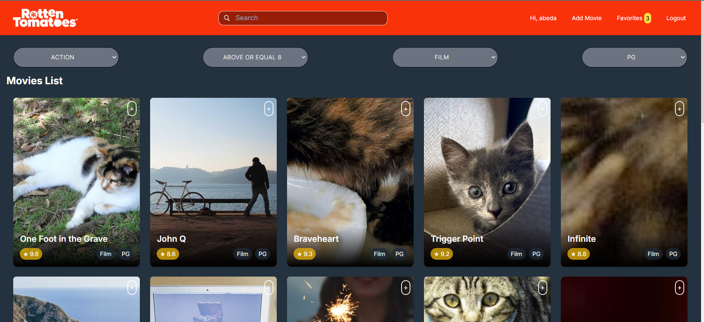

# Movie Review App - Rotten Tomatoes Clone

A full-stack movie review application similar to Rotten Tomatoes. This project allows users to search, rate, review, and manage their movie favorites list while exploring movie genres and details. Built with cutting-edge technologies for a seamless experience.

## Technologies Used

#### Frontend

    Framework: Next.js with TypeScript
    State Management: Redux Toolkit with Redux Persist
    Styling: Tailwind CSS
    Form Handling: React Hook Form
    Notifications: React Toastify

#### Backend

    Framework: Express.js with TypeScript
    Database: PostgreSQL with Sequelize ORM
    Search Engine: Elasticsearch
    Authentication: JWT (JSON Web Tokens)
    Image Handling: Multer and Sharp
    Validation: Zod
    Environment Management: Dotenv
## Frontend

#### Overview
The frontend of the Movie Review App is built with Next.js, TypeScript, and Tailwind CSS. It provides a user-friendly interface for exploring movies, managing reviews, and maintaining a personalized favorite list. Redux Toolkit is used for state management, and React Hook Form is utilized for handling forms efficiently.

#### Features and Pages
#### 1. Homepage

<p align="center"><em>Figure 1: Homepage</em></p>

- Displays a paginated list of movies.
- Infinite scrolling with filters for genre, rating, type, and certificate.
- Search bar for finding movies based on keywords.
- Implements a DiscoveryHeader for filtering and searching movies.

#### 2. Movie Details Page

<p align="center"><em>Figure 2: Movie Details Page</em></p>

- Shows detailed information about a movie (e.g., rating, genres, duration, certificate).
- Allows users to view and add reviews.
- Users can edit or delete their reviews.
- Ratings are dynamically updated.

#### 3. Search and Filters

<p align="center"><em>Figure 3: Search</em></p>


<p align="center"><em>Figure 4: Filters</em></p>

- Search functionality integrated with filters.
- Users can filter movies based on:
    - Genre: Select from predefined genres.
    - Rating: Filter movies by rating range.
    - Type: Filter by "Film" or "Series."
    - Certificate: Select movies based on certification (e.g., "PG-13", "R").

#### 4. Favorite List

<p align="center"><em>Figure 5: Favorites</em></p>

- Users can add or remove movies to their favorite.
- Displays a list of favorite movies with thumbnail previews.
- Allows navigation to movie details from the favorite list.

#### 5. User Authentication

<p align="center"><em>Figure 6: Registration</em></p>


<p align="center"><em>Figure 7: Login</em></p>

- Register: Users can create an account with required details.
- Login: Authenticated users can access protected features.
- Session state is stored in cookies.

#### 6. Create & Manage Movies

<p align="center"><em>Figure 8: Create Movie Form</em></p>

- Users can create a new movie with:
    - Name, release year, duration, description, type, certificate, and thumbnail.
    - Select up to 3 genres.
- Movies created by the user are listed below the form with options to:
    - Edit: Update movie details.
    - Delete: Remove a movie.


## Backend

#### Overview

The backend of the Movie Review App provides a RESTful API to handle user authentication, movie management, reviews, and favorite list. It is built with Express.js and TypeScript, using PostgreSQL as the database with Sequelize ORM, and incorporates Elasticsearch for advanced searching capabilities. Images are stored locally using Multer, with compression handled by Sharp.

#### Features

- User Authentication: Secure JWT-based authentication for users.
- Movie Management: CRUD operations for movies, including Elasticsearch indexing for search functionality.
- Reviews: Add, update, and delete reviews, with dynamic average rating and vote count calculations.
- Favorite List: Manage user-specific favorites.
- Search: Elasticsearch-powered full-text search and filtering.
- Image Uploads: Upload and compress images using Multer and Sharp.

#### Database Design

Below is the Entity Relationship Diagram (ERD) used for the application:

Note: The ERD includes key tables such as User, Movie, Review, Genre, and associations like MovieGenre, WatchList (favorite in frontend), and UserMovie.

#### API Endpoints
##### User Routes (/api/users)
| Method | Endpoint      | Description                |
|--------|---------------|----------------------------|
| POST   | /register     | Register a new user        |
| POST   | /login        | Log in an existing user    |
##### Movie Routes (/api/movies, /api/usermovie)
| Method | Endpoint          | Description                                   |
|--------|-------------------|-----------------------------------------------|
| GET    | /movies           | Fetch all movies with filters and search      |
| GET    | /movie/:id        | Get details of a movie, including reviews     |
| POST   | /usermovie        | Create a new movie                            |
| GET    | /usermovie        | Fetch all movies created by the user          |
| PUT    | /usermovie/:id    | Update a movie created by the user            |
| DELETE | /usermovie/:id    | Delete a movie created by the user            |
##### Review Routes (/api/:id/review)
| Method | Endpoint         | Description                          |
|--------|------------------|--------------------------------------|
| GET    | /:id/reviews     | Fetch all reviews for a movie        |
| POST   | /:id/review      | Add or update a review for a movie   |
| DELETE | /:id/review      | Delete a review for a movie          |
##### Watchlist Routes (/api/watchlist) (favorite in frontend)
| Method | Endpoint         | Description                          |
|--------|------------------|--------------------------------------|
| POST   | /watchlist       | Add a movie to the watchlist         |
| GET    | /watchlist       | Fetch the user's watchlist           |
| DELETE | /watchlist/:id   | Remove a movie from the watchlist    |

### Installation and Setup

#### Steps

1. Clone the repository:

```
    git clone https://github.com/your-repo/movie-review-app.git
    cd movie-review-app/backend
```

2. Install dependencies:
    `npm install`

3. Set up the environment variables in .env:

```
    PORT=5000
    DB_NAME=moviewebapp
    DB_USER=mysqlclient
    DB_PASSWORD=admin
    DB_HOST=localhost
    SECRET_TOKEN=your_secret_token
```

4. Start the PostgreSQL database and Elasticsearch server.
5. Run database migrations and seed data:

```
    npx sequelize-cli db:migrate
    npx sequelize-cli db:seed:all
```

6. Start the backend server:
    `npm run dev`

7. The server will be running at http://localhost:5000.

### Key Features
#### Authentication Middleware

Located in `middlewares/authUser.ts`, this middleware ensures secure access to protected routes by verifying JWT tokens.
#### Image Uploads

Images are uploaded using Multer and stored in the `uploads/` folder. Sharp is used for resizing and compressing images.
#### Elasticsearch Integration

Movies are indexed in Elasticsearch for fast and efficient search. The `getAllMovies` controller handles complex queries with filters and sorting.

## Future Enhancements

    Cloud Storage: Move image storage to a cloud provider (e.g., Cloudinary).
    Analytics: Add analytics for user and movie data.
    Social Features: Allow users to follow each other and share watchlists(fav).
